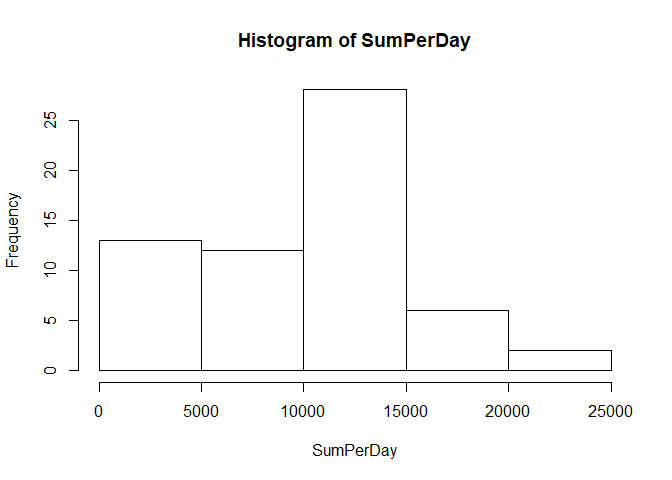
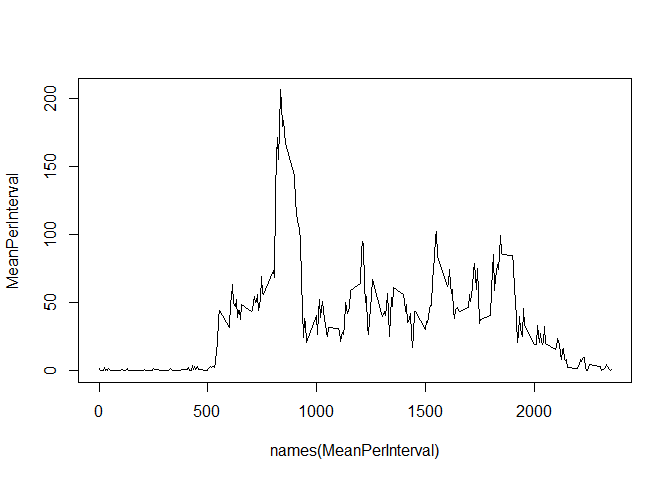
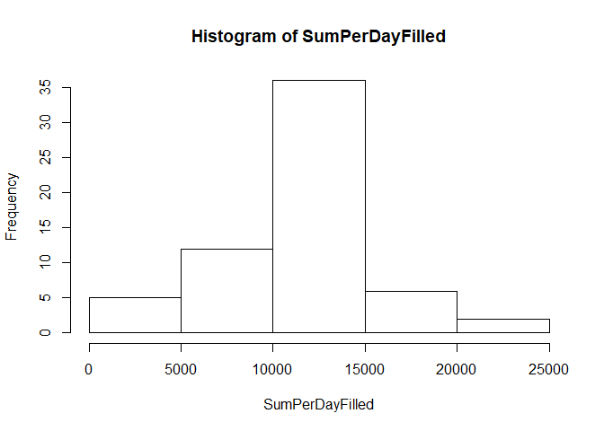
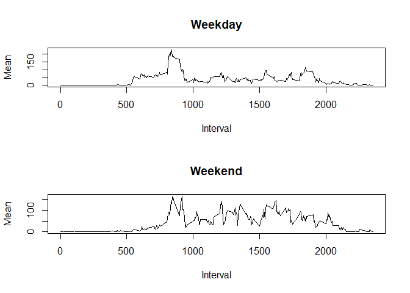

```r
knitr::opts_chunk$set(echo = TRUE)
```

## Loading and preprocessing the data


```r
activity = read.csv("activity.csv")
```

## What is the mean total number of steps taken per day?

```r
SumPerDay = tapply(activity$steps, activity$date, sum, na.rm=TRUE)
hist(SumPerDay)
```

<!-- -->

```r
mean(SumPerDay)
```

```
## [1] 9354.23
```

```r
median(SumPerDay)
```

```
## [1] 10395
```

## What is the average daily activity pattern?
Time series plot of the 5-minute interval and the average number 
of steps taken, averaged across all days

```r
MeanPerInterval = tapply(activity$steps, activity$interval, mean, na.rm=TRUE)
plot(names(MeanPerInterval), MeanPerInterval, type="l")
```

<!-- -->

We will use the function $which.max$ to find the 5-minute interval across all the days in the dataset with the maximum average number of steps.

```r
names(which.max(MeanPerInterval))
```

```
## [1] "835"
```

## Imputing missing values
Calculate and report the number of missing values
Fill in the missing values in the dataset, we will use the mean for that interval

```r
# Counting number of missing values
# Fill in the missing value with the Mean for that interval
count=0
activityFilled = activity
for (i in 1:nrow(activity))
{
    if (is.na(activity[i,1])) 
    {
        count = count + 1
        activityFilled$steps[i] = MeanPerInterval[match
                                 (activityFilled$interval[i],
                                names(MeanPerInterval))]
    }
}
count
```

```
## [1] 2304
```

```r
# Make a histogram of the total number of steps each day
# Calculate and report mean and median of the totals
SumPerDayFilled = tapply(activityFilled$steps, activityFilled$date, sum)
hist(SumPerDayFilled)
```

<!-- -->

```r
mean(SumPerDayFilled)
```

```
## [1] 10766.19
```

```r
median(SumPerDayFilled)
```

```
## [1] 10766.19
```

After looking at the mean and median with the filled values, they are very different from the non-filled values.


## Are there differences in activity patterns between weekdays and weekends?

Creating a new factor variable indicating whether the date is a weekday or weekend

```r
activityFilled$dayFactor = ""
for (i in 1:nrow(activityFilled))
{
     day = weekdays(as.Date(activityFilled$date[i]))
     if ((day == "Saturday") || (day == "Sunday"))
     {
         activityFilled$dayFactor[i] = "weekend"
     }
     else
     {
         activityFilled$dayFactor[i] = "weekday"
     }
}
activityFilled$dayFactor = as.factor(activityFilled$dayFactor)

# Separate the Weekend and Weekdays
activityFilledWeekday = activityFilled[activityFilled$dayFactor == "weekday",]
activityFilledWeekend = activityFilled[activityFilled$dayFactor == "weekend",]

# Setup the panel
par(mfrow = c(2,1))

# Calculate the Mean per interval on weekends and weekdays
MeanPerIntervalFilledWeekday = tapply(activityFilledWeekday$steps, activityFilledWeekday$interval, mean)
MeanPerIntervalFilledWeekend = tapply(activityFilledWeekend$steps, activityFilledWeekend$interval, mean)

# Now Plot
plot(names(MeanPerIntervalFilledWeekday), MeanPerIntervalFilledWeekday, type = "l", xlab = "Interval", ylab = "Mean", main = "Weekday")
plot(names(MeanPerIntervalFilledWeekend), MeanPerIntervalFilledWeekend, type = "l", xlab = "Interval", ylab = "Mean", main = "Weekend")
```

<!-- -->
